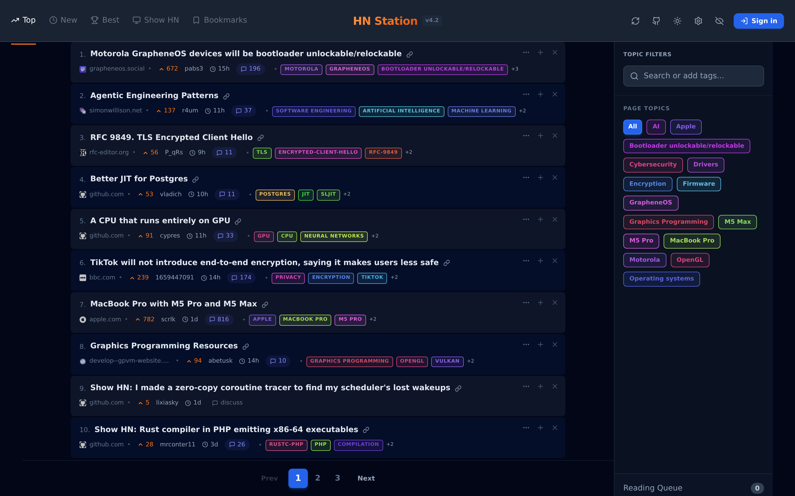
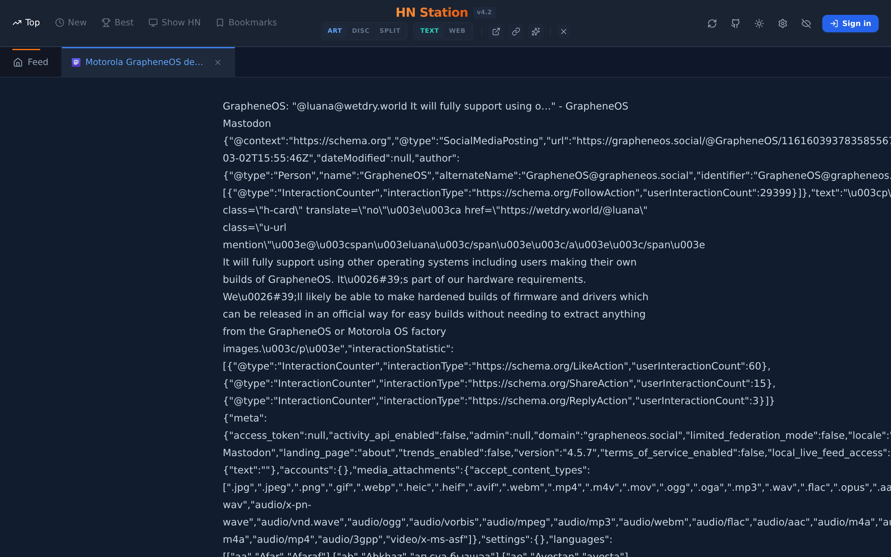
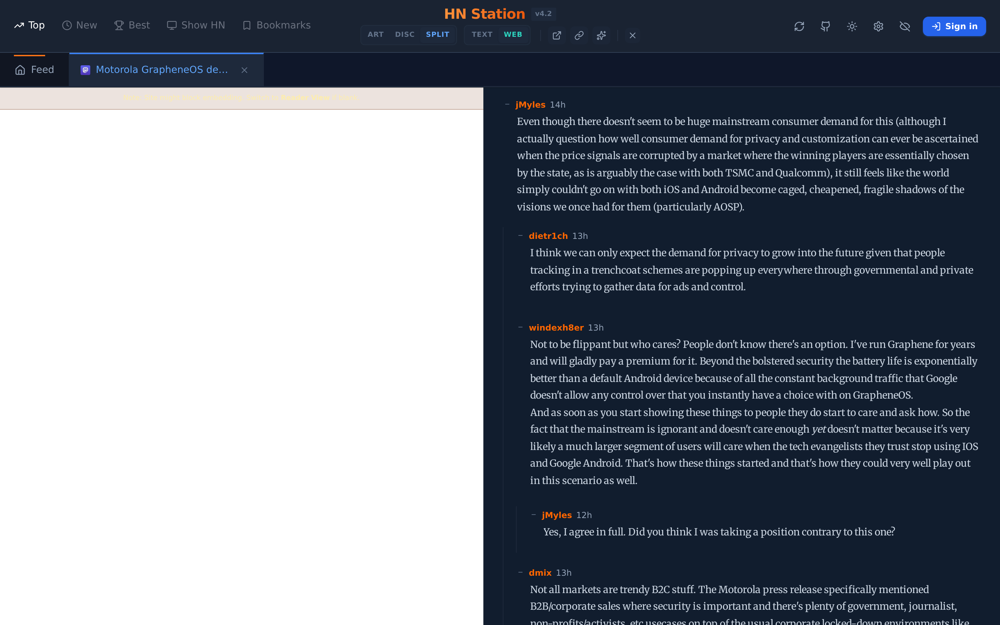

# Hacker News Station

[](https://go.dev)
[](https://react.dev)
[](https://typescriptlang.org)
[](https://postgresql.org)
[](https://kubernetes.io)
[](https://docker.com)
[](https://hnstation.dev)

A modern, fast, and feature-rich Hacker News client built with Go and React. Live at **[hnstation.dev](https://hnstation.dev)**.



### Article View


### Discussion View


---

## Features

| Category | Highlights |
|----------|-----------|
| **Reading** | 3-pane resizable layout · Reader Mode (`go-readability`) · Smart iframe fallback |
| **Comments** | Recursive collapsible threads · Keyboard nav (`n`/`p` root comments) |
| **Discovery** | Topic filters (Postgres, LLM, Rust, …) · Full-text search (PostgreSQL `tsvector`) |
| **AI (BYOK)** | "Zen" Summary Overlay (pre-cached) · Semantic Topic Tagging · Local GPU Ingestion |
| **Auth** | Google OAuth · Bookmarks · Read/hidden state synced to DB |
| **Navigation** | Full keyboard control · `j`/`k`, `/` search, `z` Zen mode, `Delete` to hide |
| **Infra** | Docker Compose · Kubernetes (AKS + local Kind) |

---

## Tech Stack

| Layer | Technology |
|-------|-----------|
| Backend API | Go · `go-chi/chi` |
| Ingestion | Go worker pool · HN Firebase REST API |
| AI | Ollama (`qwen2.5-coder`) · Local GPU · Discussion Context |
| Database | PostgreSQL · `pgx/v5` · `pgvector` |
| Auth | Google OAuth 2.0 · JWT (HS256) cookies |
| Frontend | React 18 · TypeScript · Tailwind CSS · Vite |
| Infrastructure | Docker · Kubernetes (AKS / Kind) · NGINX Ingress |

---

## Getting Started

### Prerequisites

- Docker and Docker Compose

### Docker Compose (Quickstart)

```bash
# 1. Clone the repo
git clone https://github.com/rajeshkumarblr/hn_station && cd hn_station

# 2. Configure environment
cp .env.example .env   # fill in Google OAuth credentials, JWT_SECRET, optional GEMINI_API_KEY

# 3. Start everything
docker-compose up --build
```

Open **http://localhost:3000** in your browser.

### Local Kind Cluster

```bash
./infrastructure/deploy_local.sh
```

Uses the manifests in `infrastructure/k8s-local/`, pointing Postgres at your host machine's running PostgreSQL instance. See [`DEPLOY.md`](DEPLOY.md) for full details.

---

## Architecture

The system has four main components: a **Go ingestion worker** (polls HN every minute), a **Go API server** (REST + static file serving), a **React frontend**, and a **PostgreSQL database**.

For a detailed breakdown — component responsibilities, all API routes, database schema, data flow diagrams, and infrastructure layout — see **[architecture.md](architecture.md)**.

---

## Environment Variables

| Variable | Required | Description |
|----------|:--------:|-------------|
| `DATABASE_URL` | ✅ | PostgreSQL connection string |
| `JWT_SECRET` | ✅ | Secret for signing JWT session tokens |
| `GOOGLE_CLIENT_ID` | ✅ | Google OAuth client ID |
| `GOOGLE_CLIENT_SECRET` | ✅ | Google OAuth client secret |
| `OAUTH_CALLBACK_URL` | ✅ | Full callback URL (e.g. `https://hnstation.dev/auth/google/callback`) |
| `OLLAMA_URL` | ⬜ | URL for local Ollama instance (e.g. `http://localhost:11434`) |
| `FRONTEND_URL` | ⬜ | Redirect URL after OAuth (defaults to `/`) |

---

## Recent Updates

- **v3.3** — Replaced pagination with a streaming story buffer (auto-refills and smoothly handles hiding stories like a linked list). Web View is now the default when opening an article with a URL. Fixed z-index layering for hover summaries.
- **v3.2** — Tag Coloring: Each topic now gets a mathematically unique HSL color. Tag filters use a colored ring for their active state instead of a solid background. Active story titles and their left border match the selected topic's color.
- **v3.1** — Top bar redesigned: nav tabs (Top/New/Best…) moved to the left, "HN Station" centered in orange with version below it. Mixed-content (HTTP→HTTPS) fix for article reader. Opaque light-blue hover summary popup.- **v3.0** — Feed UI refinements: high-contrast light-blue zebra striping, deterministic color-coded tags in feed and sidebar, mouse-relative AI summary popups truncated to 2 sentences.
- **Phase 43** — High-Density Feed & In-Place Tag Highlighting: Compact 10-story feed with always-visible metadata. Color-coded green highlighting for active topics without re-fetching. Ingestion as a systemd background service (v2.21.1-m).
- **Zen AI & Local Automation** — Decommissioned heavy interactive sidebar and chat backend. Integrated sleek "Zen" summary overlay into ReaderPane with pre-cached content. Automated local ingestion via `flock`-protected scripts, moving expensive AI workloads from Azure to local GPU.
- **Phase 42** — Index -> Show Architecture Refactor: Dedicated Feed & Zen Reader views. Explicit reading queue, minimalist browser-like ReaderPane navigation.
- **Phase 41** — Redeployed to Azure AKS (`eastus`), upgraded Key Vault CSI integration, configured proper Load Balancer health probes, and enabled automated Let's Encrypt SSL.
- **Phase 38** — Reader Mode: server-side article fetch + sanitize (`go-readability` + `dompurify`), smart iframe fallback.
- **Phase 36** — Admin Panel v2: Grafana-style analytics dashboard with user list and activity metrics at `/admin`.
- **Phase 35** — Full light mode support, hover-expand story cards, zebra striping.
