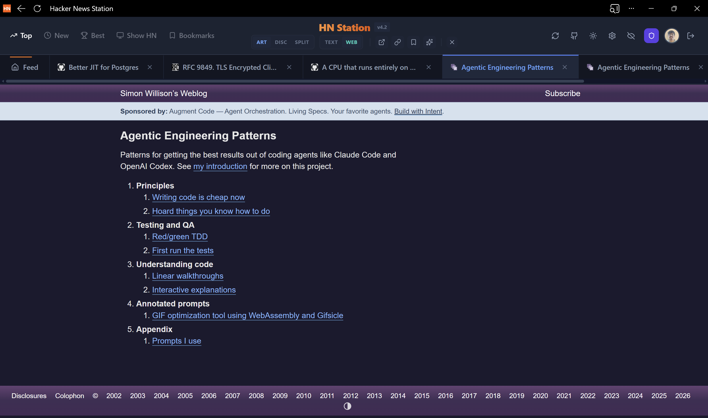
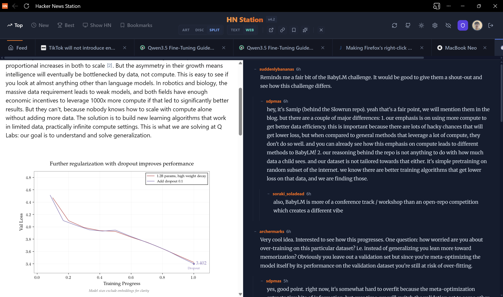
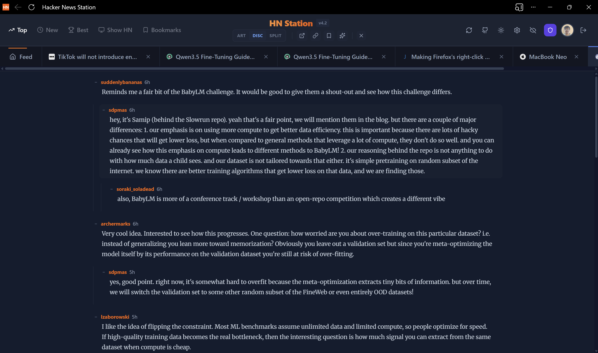

# Hacker News Station

[](https://go.dev)
[](https://react.dev)
[](https://typescriptlang.org)
[](https://postgresql.org)
[](https://kubernetes.io)
[](https://docker.com)
[](https://hnstation.dev)

A modern, fast, and feature-rich Hacker News client built with Go and React. Live at **[hnstation.dev](https://hnstation.dev)**.


### Article View


### Split View


### Discussion View


---

## Features

- **Split-Pane Workspace**: A modern 3-pane responsive layout that allows you to seamlessly browse the feed, read articles natively (or via Reader Mode), and view HN discussions side-by-side. 
- **Automated AI Summaries & Tagging**: A background Go ingestion worker automatically fetches top HN articles, uses local LLMs (via Ollama) to pre-generate concise "Zen" summaries, and tags them with deterministic semantic topics (e.g., Postgres, Rust, AI) for quick visual scanning.
- **Smart Reader Mode**: Includes specialized Web/Text fallback toggles. By default, it embeds websites natively or renders PDFs via `<object>` tags, and smoothly falls back to a clean text-only "Reader Mode" (`go-readability`) if paywalled or blocked.
- **Archive Retention**: Intelligently maintains an actively rolling 7-day database archive of the top stories for continuous scrolling, with permanent retention for securely bookmarked items.
- **Advanced Comment Threads**: Deeply nested, recursive, and collapsible HN discussion threads. Navigate smoothly with deep keyboard bindings.
- **Topic Filters & Search**: Full-text PostgreSQL `tsvector` search and dynamic tag filtering directly in the feed.
- **Keyboard-First Navigation**: Vim-like feed navigation (`j`/`k`), `/` to search, `z` for Zen mode overlay, and `Delete` to hide/skip stories.
- **Customization & Sync**: Native Google OAuth integration. Your read states, queued stories, skipped items, and bookmarks are seamlessly synced to the database.

---

## Tech Stack

| Layer | Technology |
|-------|-----------|
| Backend API | Go · `go-chi/chi` |
| Ingestion | Go worker pool · HN Firebase REST API |
| AI | Ollama (`qwen2.5-coder`) · Local GPU · Discussion Context |
| Database | PostgreSQL · `pgx/v5` · `pgvector` |
| Auth | Google OAuth 2.0 · JWT (HS256) cookies |
| Frontend | React 18 · TypeScript · Tailwind CSS · Vite |
| Infrastructure | Docker · Kubernetes (AKS / Kind) · NGINX Ingress |

---

## Getting Started

### Prerequisites

- Docker and Docker Compose

### Docker Compose (Quickstart)

```bash
# 1. Clone the repo
git clone https://github.com/rajeshkumarblr/hn_station && cd hn_station

# 2. Configure environment
cp .env.example .env   # fill in Google OAuth credentials and JWT_SECRET

# 3. Start everything
docker-compose up --build
```

Open **http://localhost:3000** in your browser.

### Local Kind Cluster

```bash
./infrastructure/deploy_local.sh
```

Uses the manifests in `infrastructure/k8s-local/`, pointing Postgres at your host machine's running PostgreSQL instance. See [`DEPLOY.md`](DEPLOY.md) for full details.

---

## Architecture

The system has four main components: a **Go ingestion worker** (polls HN periodically, fetching articles and automatically generating AI summaries & topic tags via a local GPU node), a **Go API server** (REST + static file serving), a **React frontend**, and a **PostgreSQL database**.

For a detailed breakdown — component responsibilities, all API routes, database schema, data flow diagrams, and infrastructure layout — see **[architecture.md](architecture.md)**.

---

## Environment Variables

| Variable | Required | Description |
|----------|:--------:|-------------|
| `DATABASE_URL` | ✅ | PostgreSQL connection string |
| `JWT_SECRET` | ✅ | Secret for signing JWT session tokens |
| `GOOGLE_CLIENT_ID` | ✅ | Google OAuth client ID |
| `GOOGLE_CLIENT_SECRET` | ✅ | Google OAuth client secret |
| `OAUTH_CALLBACK_URL` | ✅ | Full callback URL (e.g. `https://hnstation.dev/auth/google/callback`) |
| `OLLAMA_URL` | ⬜ | URL for local Ollama instance (e.g. `http://localhost:11434`) |
| `FRONTEND_URL` | ⬜ | Redirect URL after OAuth (defaults to `/`) |


