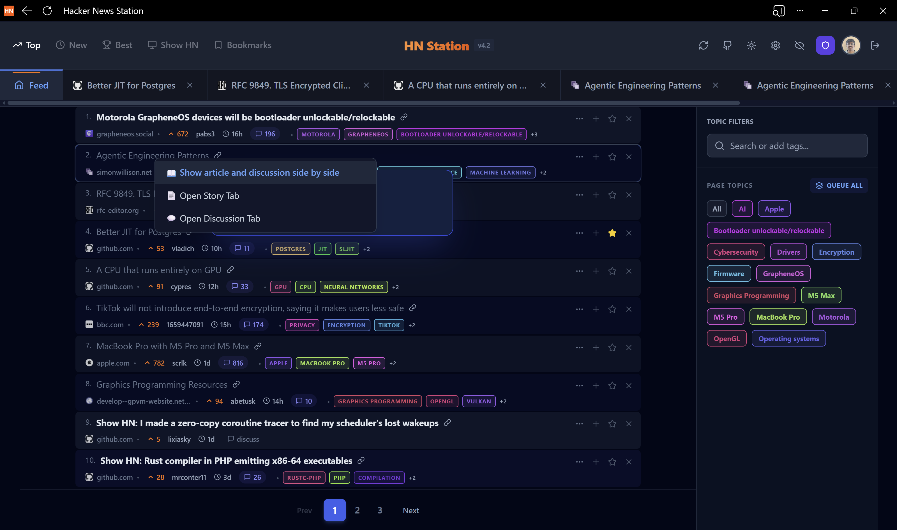

# Hacker News Station

[](https://go.dev)
[](https://react.dev)
[](https://typescriptlang.org)
[](https://postgresql.org)
[](https://hnstation.dev)

A modern, fast, and feature-rich Hacker News client built with Go and React. Live at **[hnstation.dev](https://hnstation.dev)**, or as a **fully-contained local Desktop app**.



---

## 🖥️ Electron Desktop App (Local Mode)

A powerful, zero-login desktop experience. It bundles its own Go backend and uses a local SQLite database for offline-first persistence.

### 🏁 Prerequisites
- **Go 1.21+**
- **Node.js 18+**
- **Ollama** (Optional, for AI summaries)

### 💻 Windows Native Setup (Recommended)
To avoid window management issues common in WSL/Linux virtualization:
1. **Clone**: `git clone https://github.com/rajeshkumarblr/hn_station.git`
2. **Install**: `cd web && npm install`
3. **Launch**: `cd .. && .\hn-station.ps1` (PowerShell)

### 🐧 Linux/WSL Setup
1. **Build**: `go build -o web/resources/hn-local ./cmd/local`
2. **Install**: `cd web && npm install`
3. **Launch**: `./hn-station.sh`

---

## ✨ Features

- **Split-Pane Workspace**: Browse the feed and read articles side-by-side.
- **Automated AI Summaries**: Concise article takeaways powered by Local Ollama or Gemini Pro with intelligent fallback (v1.1.1).
- **Tabbed Settings Modal**: Centralized management for AI providers, UI themes, and keyboard shortcuts in a modern tabbed interface (v1.1.1).
- **Zero-Login Local Mode**: Persistence via embedded SQLite; no account needed.
- **Global Search**: Search the entire database by topic with server-side filtering.
- **Multi-Tag Search**: Comprehensive topic management with the ability to filter by multiple tags simultaneously (v1.1.1).
- **Simplified "Zen" UI**: Minimalist top navigation and optimized reader workspace for focus (v1.1.1).
- **Keyboard-First**: Vim-like navigation (`j`/`k`), `PageUp`/`PageDown` for pagination, `Enter` to read, `z` for Zen mode.
- **Robust WebView Reader**: Seamless article reading using integrated Electron webviews.
- **Precise 10-Item Layout**: Optimized feed view that fits exactly 10 stories per page for perfect alignment.

---

## 🚀 Web Setup (Docker)

```bash
git clone https://github.com/rajeshkumarblr/hn_station && cd hn_station
cp .env.example .env   # add OAuth & Secret
docker-compose up --build
```
Open **http://localhost:3000**.

---

## 🏗️ Architecture
The system consists of a Go ingestion worker, a Go REST API, and a React frontend. See **[architecture.md](architecture.md)** for technical details.
