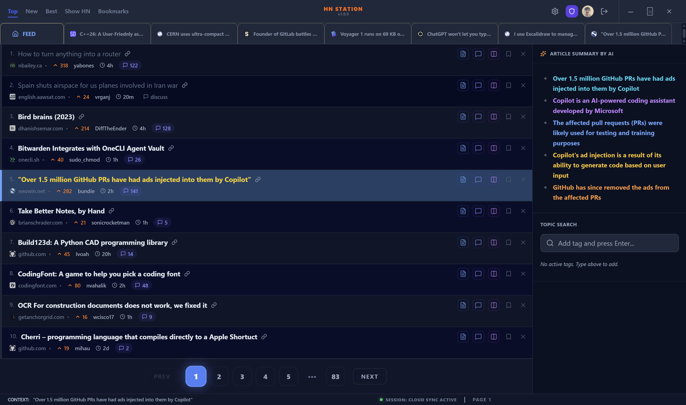
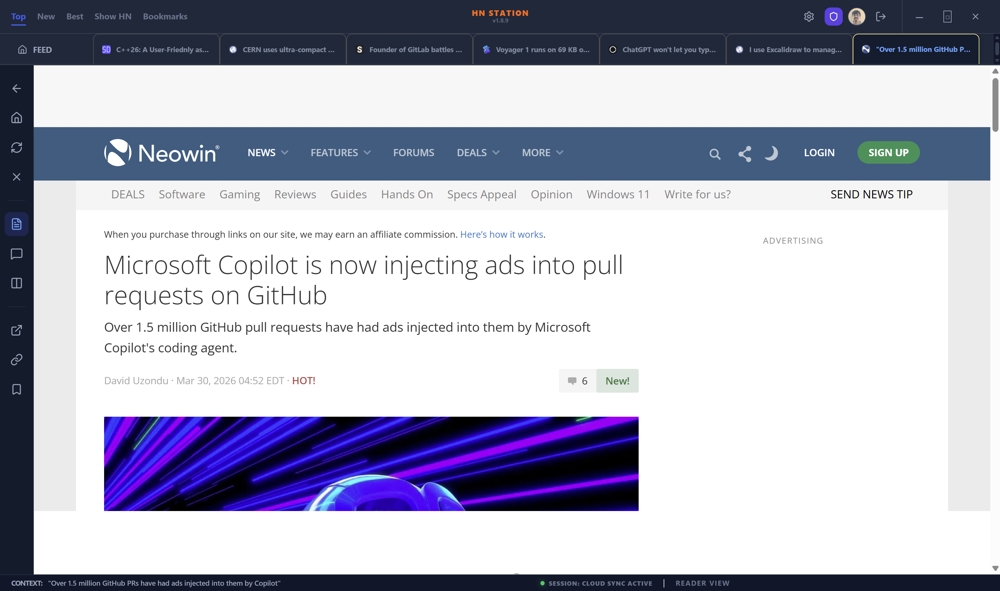
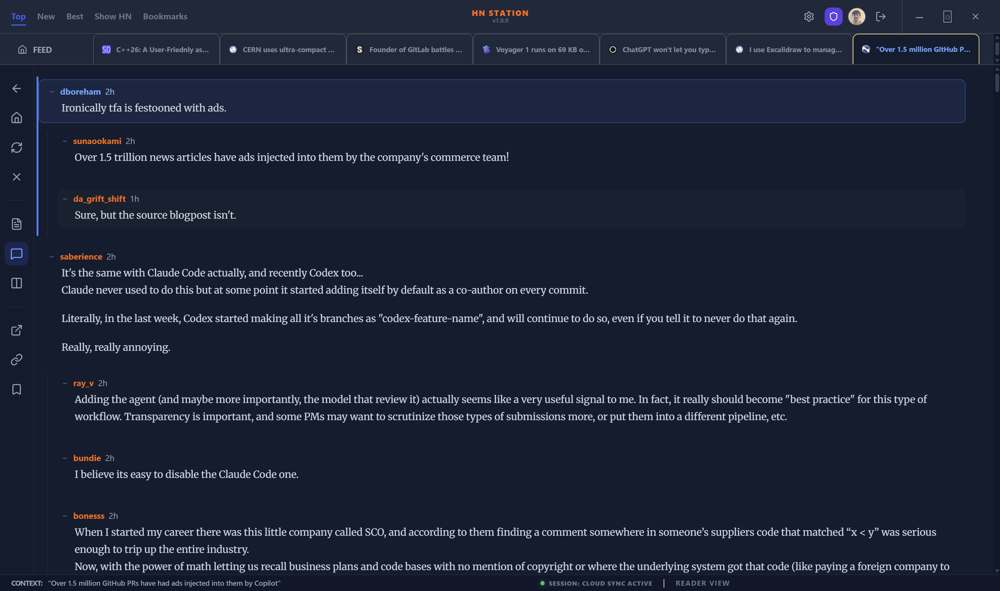
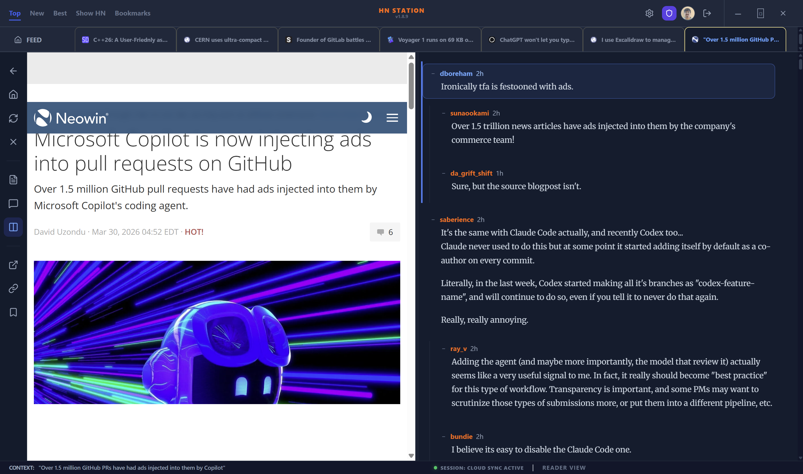

# Hacker News Station

[](https://go.dev)
[](https://react.dev)
[](https://typescriptlang.org)
[](https://postgresql.org)
[](https://hnstation.dev)

A modern, fast, and feature-rich Hacker News client built with Go and React. Live at **[hnstation.dev](https://hnstation.dev)**, or as a **fully-contained local Desktop app**.

### 🛠️ App Experience

#### 1. Feed View


#### 2. Article Reading


#### 3. Threaded Discussions


#### 4. Split-Pane Workspace


---

## 🖥️ Electron Desktop App (Local Mode)

A powerful, zero-login desktop experience. It uses a **Background Windows Service** for continuous story ingestion, ensuring your feed is always fresh even when the app is closed.

### ✨ Desktop Features (v1.9.0)
- **Persistent Cloud Auth**: Local SQLite storage for Google profiles ensures your "Signed In" status stays active across restarts.
- **Enhanced Tab Visuals**: Active tab headers now match the content area's background for a seamless "connected" feel.
- **Tab Refresh Buttons**: Dedicated manual refresh buttons for the Feed and individual story tabs.
- **Improved Ctrl+Tab**: High-reliability tab cycling using `e.code` detection.
- **Optimized Split Ratio**: Default 70/30 (Article/Comments) split for better readability.
- **Background Ingestion Service**: Stories are fetched continuously in the background via a native Windows service.
- **Shared Persistent Storage**: Your database stays safe at `C:\ProgramData\HNStation\hn.db` even during app upgrades.
- **Automated Service Management**: Installer (v1.9.0+) automatically stops, replaces, and restarts the background ingestion service.
- **Robust Port-Mapping**: Uses a safe, non-conflicting port (`58090`) to avoid common system blocks.

### 🏁 Prerequisites
- **Windows 10/11** (Recommended)
- **Ollama** (Optional, for local AI summaries)

### 💻 Windows Native Setup (Internal Release)
The desktop app is now distributed as a single **Unified Installer**:
1. Run `HN Station Setup 1.9.0.exe` (installed per-machine).
2. The installer automatically manages the **HN Station Ingestion Service** (stop/replace/restart).
3. Launch **HN Station** from your Start menu or Desktop.

---

## ✨ System Features

- **Split-Pane Workspace**: Browse the feed and read articles side-by-side.
- **Automated AI Summaries**: Concise article takeaways powered by Local Ollama or Gemini Pro.
- **Tabbed Settings Modal**: Centralized management for AI providers and UI themes.
- **Multi-Tag Search**: Comprehensive topic management with parallel filtering.
- **History-Based Navigation**: Intelligent "Back" logic for a cleaner workflow.
- **Keyboard-First**: Vim-like navigation (`j`/`k`), `Enter` to read.

---

## 🚀 Web Setup (AKS)

The web version is deployed to Azure Kubernetes Service (AKS) as a **Unified Container**:
- **Consolidated Architecture**: The Go backend embeds and serves the React SPA assets directly (removed obsolete Nginx layer).
- **Postgres**: Managed StatefulSet with Persistent Volume (`database=my_hn`).
- **Backend/Ingest**: Go-based services with Azure Key Vault integration via Secret Store CSI.

### 🔧 AKS Troubleshooting & Fixes (v1.9.0)
- **Database Name**: The cloud database is named `my_hn`.
- **Secret Keys**: Using `DATABASE_URL` as the canonical connection string key.
- **Health Check**: Monitor pod health via `kubectl logs -l app=backend`.

### 🏁 Internal Deployment
```bash
# Build and deploy to AKS
powershell -File infrastructure/deploy_aks.ps1
```

---

## 🏗️ Architecture
The system follows a decoupled architecture:
1. **Ingestion Service**: A background Go worker for continuous HN data fetching.
2. **Unified Backend**: A containerized Go API that serves the React SPA and provides the data layer (Postgres).
3. **Local Agent**: A lightweight Go server (local mode) providing SQLite storage and data proxying for Electron.
4. **React Frontend**: Shared UI with platform-agnostic adapters for Web vs. Electron.
