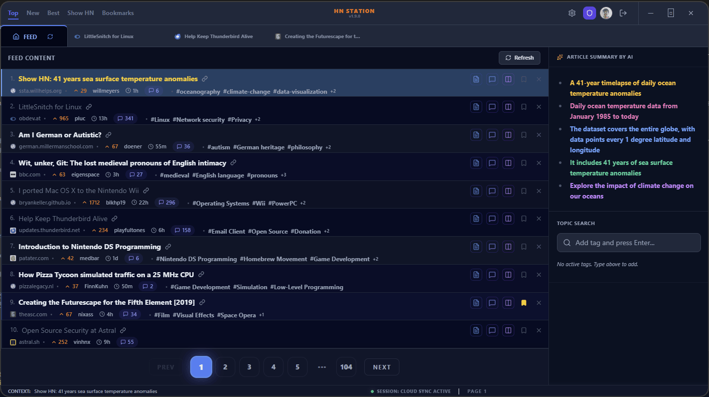

# Hacker News Station

[](https://go.dev)
[](https://react.dev)
[](https://typescriptlang.org)
[](https://sqlite.org)
[](https://hnstation.dev)

A modern, fast, and feature-rich Hacker News client built with Go and React. Optimized for the desktop experience with local-first persistence.

### ⚡ The Experience
> [!TIP]
> **Desktop vs. Web**: The Web version is a "Lite" preview. For the **unrestricted split-pane experience** that loads almost any article side-by-side with comments and offers persistent local storage, use the **Desktop App**.


*A seamless split-view for reading and discussing simultaneously.*

---

## 🖥️ Electron Desktop App (v0.9.7)

The desktop app is designed for speed and reliability, featuring a **Local-First Architecture** where your data is stored directly on your machine.

### ✨ Key Features
- **Built-in Privacy Engine**: Integrated high-performance Ad Blocker and "Ghost Mode" Cookie Stripper. Intercepts and blocks tracking/ad networks at the engine level for faster, private browsing.
- **"Safe Dark Mode" for Articles**: Intelligent, selective CSS injection that forces external articles into a high-contrast dark theme while preserving media quality and text readability.
- **Canonical Tag Mapping**: Implement a user-editable `tag_mappings.json` to group fragmented topics (e.g., mapping "LLM" to "Language Model", "MoE", "Transformers"). The backend automatically expands searches to catch all relevant synonyms.
- **Hot-Reloading Engine**: Mapping changes are picked up by the Go backend every 5 seconds, allowing for instant filtering updates without restarting the application.
- **"Smart Selection" Feed UI**: Story cards now dynamically filter their displayed tags based on your active selection, eliminating "distracting" unrelated tags while you are focused on a specific topic.
- **Visual Color Synchronization**: Article synonyms (like "#LanguageModels") automatically inherit the color of their canonical parent filter ("#LLM"), ensuring a consistent visual language across the feed.
- **Unlimited Historical Growth**: Disabled the automatic 7-day story pruning. Your local database now grows indefinitely, building a complete historical archive of your Hacker News feed.
- **Hybrid FTS5 Search**: Integrated SQLite's Full-Text Search (FTS5) for lightning-fast, precise keyword queries across article titles, summaries, and topics.
- **Dynamic Filter Logic**: Introducing "ANY/ALL" match logic for topic filtering. Choose between broad discovery (OR) or surgical precision (AND) when selecting multiple tags.
- **#ALL Global Reset**: A dedicated, uniquely styled "Global Reset" tag that instantly clears all filters and searches, returning the feed to its default state.
- **Premium "SaaS" UI Refinement**: High-end aesthetic with glassmorphism, `backdrop-blur` effects, and a sophisticated Inter/Outfit typography stack.
- **Integrated AI Workspace**: A high-performance sidebar hosting **Discussion**, **Gemini Chat**, and **AI Summaries** in a unified view. All article-level tags are neatly moved here to keep the main feed clean.
- **AI Model Persistence**: Seamlessly save and restore your preferred local AI model (Ollama) or cloud provider (Gemini). Your model choices are now persisted across sessions in the local SQLite database, ensuring consistency between background ingestion and manual summaries.
- **DOM-Virtualized Infinite Scroll**: Replaced traditional pagination with a high-performance virtualization engine, allowing seamless scrolling through thousands of local articles without UI lag.
- **Selective AI Tagging**: Transitions from mandatory tagging to a relevance-based model. AI now provides up to 3 high-precision technical tags only if they truly apply, effectively eliminating "hallucinated" topics.
- **Chrome-Style Flexible Tabs**: Implemented an intelligent tab management system where tabs automatically shrink and truncate as more are opened, preserving the layout even under heavy load.
- **"Articles" Quick-Switch Menu**: A dedicated navigation menu in the top header providing a unified list of all open articles for instant switching.

### ⌨️ Keyboard Shortcuts

| Shortcut | Action |
| :--- | :--- |
| **View Control** | |
| `Ctrl + 0` | Return to **Feed** view |
| `Ctrl + Home` | Switch to **Feed Tab** |
| `Ctrl + D` | Switch to **Bookmarks Tab** |
| `Ctrl + Tab` | Cycle through tabs (Forward) |
| `Ctrl + Shift + Tab` | Cycle through tabs (Backward) |
| `Ctrl + W` | Close active tab (Reader) / **Exit Application** (Feed) |
| `F5` / `Ctrl + R` | Refresh Feed or Active Tab |
| **Feed Selection** | |
| `j` / `k` or `Arrows` | Navigate stories in the feed |
| `Home` / `End` | Jump to first/last story in current view |
| `PageUp` / `PageDown` | Previous/Next 10 stories (Pagination) |
| `Ctrl + Home` | First page of current feed |
| `Enter` | Open story in **Split Mode** |
| **Reader Control** | |
| `Ctrl + Space` | Cycle layout: **Article → Discussion → Split** |
| `Ctrl + Alt + Arrows` | Incremental layout cycling |
| `Ctrl + Q` | Toggle Sidebar Visibility (Show/Hide) |
| `Ctrl + H` | Direct switch to **Discussion** Tab |
| `Ctrl + K` | Direct switch to **AI Summary** Tab |
| `Ctrl + G` | Direct switch to **Gemini Chat** Tab |

---

- **In-App Backend**: A Go-based local agent runs automatically as a background process within the app, handling continuous HN ingestion while the window is open.
- **SQLite Storage**: All data persists in a unified user-localized directory at `%APPDATA%/HN Station/` on Windows.
- **Port Mapping**: Uses port `58090` for robust communication between the UI and local agent.

---

## 🚀 Web Setup (AKS)

The web version is deployed to Azure Kubernetes Service (AKS) as a unified container, serving as a high-speed preview of the HN Station experience.

- **Frontend**: React SPA served directly by the Go backend.
- **Data Layer**: Postgres managed via StatefulSet.
- **Live Site**: [hnstation.dev](https://hnstation.dev)

---

## 🏗️ Development

### 🏁 Prerequisites
- **Go 1.22+**
- **Node.js 20+**
- **Ollama** (Optional, for local AI features)

### 💻 Build & Run
You can use the provided automation scripts or the Makefile:

**Windows (PowerShell):**
```powershell
# Build everything (Backend + Frontend)
.\scripts\build.ps1

# Run both components simultaneously
.\scripts\run.ps1
```

**macOS (Zsh/Bash):**
```bash
# Make the startup script executable
chmod +x scripts/start-desktop.sh

# Build and run the desktop app
make dev
```

**Linux (Makefile):**
```bash
# Build everything
make all

# Start backend and frontend dev servers
make dev-backend
make dev-frontend
```
