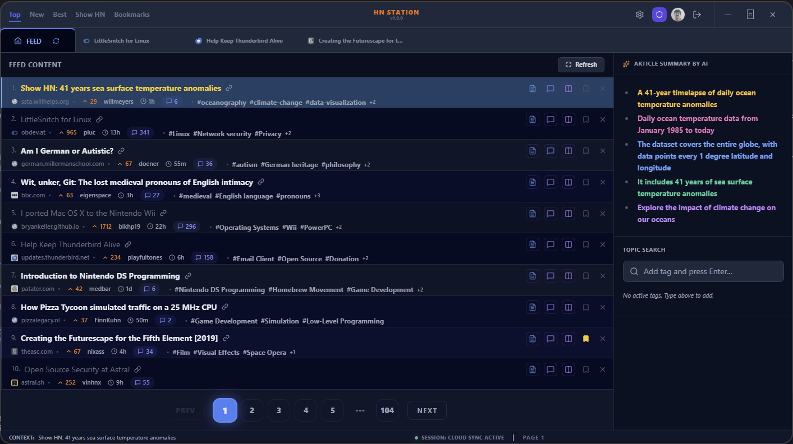

# HN Station

[](https://go.dev)
[](https://react.dev)
[](https://typescriptlang.org)
[](https://sqlite.org)
[](LICENSE)
[](https://hnstation.dev)

A local-first Hacker News desktop client. Read articles and comments side by side, get AI-powered summaries, and keep a searchable archive — all on your machine.

### 🔗 [Try it live → hnstation.dev](https://hnstation.dev)



---

## Why HN Station?

- **Split-pane reading** — Article and discussion side by side, like a proper workspace
- **Local AI assistant** — Summarize articles, analyze discussions, and chat about stories using **LiteRT-LM** (`Gemma 4 E2B`), [Ollama](https://ollama.com), Gemini, or OpenAI
- **Full-text search** — FTS5-powered instant search across titles, summaries, and topics with synonym-aware tag filtering
- **Privacy-first** — Built-in ad blocker and cookie stripper. All data stays in your local SQLite database
- **Keyboard-driven** — Navigate with `j/k`, open stories with `Enter`, cycle layouts with `Ctrl+Space`, and close tabs with `Ctrl+W`
- **Your personal archive** — Stories and comments persist locally forever. No account required

> **Web vs Desktop**: Try the [web preview at hnstation.dev](https://hnstation.dev) for a quick look. For the full experience — split-pane article loading, local AI, and persistent storage — use the desktop app.
> 
> *Note for Web Mode*: We have streamlined the web workspace into a premium, compact **2-Pane Discussion Reader**! Articles open directly in new browser tabs via double-click, while the rest of the workspace displays discussion comments, search query filters, and dynamic topic tags. Web preview runs entirely client-side with Zero-Login, isolating all bookmarks and hidden/read states to the browser's local storage.

---

## Download

| Platform | Download | Notes |
|:---|:---|:---|
| **macOS (Apple Silicon)** | [**HN.Station-0.10.0-arm64.dmg**](https://github.com/rajeshkumarblr/hn_station/releases/download/v0.10.0/HN.Station-0.10.0-arm64.dmg) | Apple Silicon (`M1` / `M2` / `M3` / `M4`) `.dmg` installer |
| **Windows** | [**HN.Station.Setup.0.10.0.exe**](https://github.com/rajeshkumarblr/hn_station/releases/download/v0.10.0/HN.Station.Setup.0.10.0.exe) | NSIS installer (`x64`) |
| **Linux** | [**hn-station_0.10.0_amd64.deb**](https://github.com/rajeshkumarblr/hn_station/releases/download/v0.10.0/hn-station_0.10.0_amd64.deb) / [All Releases](https://github.com/rajeshkumarblr/hn_station/releases/latest) | Debian/Ubuntu `.deb` (`x64`) |
| **Web** | [hnstation.dev](https://hnstation.dev) | Lite browser preview |

> **macOS First-Launch Note (Gatekeeper)**: Because the `.dmg` is ad-hoc signed without a paid Apple Developer certificate, after dragging **HN Station.app** into `/Applications`, run this once in Terminal before opening:
> ```bash
> xattr -cr "/Applications/HN Station.app"
> ```

---

## Local AI Setup (`LiteRT-LM` — Recommended for macOS)

HN Station works out-of-the-box without AI. To enable **100% private, on-device Article Summaries, Auto-Tagging, Discussion Consensus, and AI Chat**, install Google's **`LiteRT-LM`** into `~/litert-env`:

```bash
# 1. Create a virtual environment at ~/litert-env and install litert-lm
python3 -m venv ~/litert-env
source ~/litert-env/bin/activate
pip install --upgrade pip litert-lm

# 2. Download the Gemma 4 E2B model (~1.6 GB, one-time download)
litert-lm pull gemma-4-e2b-it
```

### How It Works Automatically
- **Auto-Discovery & Auto-Start**: On launch, HN Station automatically detects `~/litert-env/bin/litert-lm` and starts `litert-lm serve --port 9379` in the background if it isn't already running.
- **Model Auto-Detection**: Automatically discovers models downloaded under `~/.litert-lm/models/`.
- **macOS Thermal & Battery Protection**: On Apple Silicon Macs, HN Station automatically pins `litert-lm` to **Efficiency (E) cores** (`taskpolicy -b` + `nice +15`), checks `pmset -g therm` before background summarization, and enforces a 60-second cooldown between background summaries so your Mac stays cool and silent.

*(Prefer running the server manually? You can also run `~/litert-env/bin/litert-lm serve --port 9379` in your own terminal.)*

---

## Features

### Reader
- Chrome-style browser toolbar with Back/Forward/Refresh/Home
- Triple-state dark mode: Original, Follow System, or Forced Safe Dark
- Tabbed workspace with Chrome-style flexible tabs
- Resizable AI sidebar with Discussion, Summary, and Chat tabs

### AI Integration
- **Article summaries** — 5 bullet-point takeaways from full article text
- **Discussion analysis** — Synthesized community opinion from top comments
- **Multi-turn chat** — Ask questions about any story with full context
- **Token-by-token streaming** via SSE (`OpenAI`-compatible `/v1/chat/completions` & Ollama `/api/chat`)
- Supports **LiteRT-LM** (`http://localhost:9379`), **Ollama**, **Gemini**, and **OpenAI**

### Search & Filtering
- Hybrid FTS5 full-text search across the entire archive
- Canonical tag mapping with user-editable `tag_mappings.json`
- ANY/ALL/Exclusive match modes for multi-topic filtering
- Search-to-filter workflow: type and press Enter to create persistent topic chips

### Hacker News Integration
- **Zero-Login Proxy Architecture** — Configure Hacker News credentials in Settings. Credentials are saved locally in the browser's `localStorage` and sent over HTTPS via a secure Go proxy.
- **Feed Voting** — Upvote and downvote stories directly from the story card in the feed with live score updating.
- **Discussion Voting & Nested Replies** — Upvote/downvote comments and write nested replies directly in the discussion view.
- **Top-level posting** — Submit top-level comments to Hacker News threads directly from the AI sidebar.
- **Desktop Notifications for Favorite Topics** — Enable desktop notifications in UI Settings to receive native alerts when new stories matching your active/favorite topics are fetched. Clicking the notification focuses the app and opens the story automatically.

### Privacy Engine
- Request-level ad and tracker blocking
- Cookie stripping ("Ghost Mode")
- No telemetry, no analytics, no external calls (except HN API and your chosen AI provider)

---

## Keyboard Shortcuts

| Shortcut | Action |
| :--- | :--- |
| `j` / `k` or `↑` / `↓` | Navigate stories |
| `Enter` | Open story in split view |
| `Ctrl + Space` | Cycle layout: Article → Discussion → Split |
| `Ctrl + W` | Close tab / Exit (from Feed) |
| `Ctrl + Tab` | Next tab |
| `Ctrl + D` | Bookmarks |
| `Ctrl + 0` | Back to Feed |
| `Ctrl + Q` | Toggle sidebar |
| `Ctrl + G` | AI Chat |
| `Ctrl + H` | Discussion |
| `Ctrl + K` | AI Summary |
| `Alt + D` | Focus address bar |
| `F5` | Refresh |

---

## Architecture

```
┌────────────────────────────────────────────────────┐
│  Electron (Desktop)                                │
│  ┌───────────┐  ┌───────────────────────────────┐  │
│  │ React SPA │◄─│ Go Backend (SQLite)           │  │
│  │ (Vite)    │  │ localhost:<dynamic-port>      │  │
│  └───────────┘  │ • HN API ingestion            │  │
│                 │ • LiteRT-LM / Local AI (9379) │  │
│                 │ • FTS5 search engine          │  │
│                 └───────────────────────────────┘  │
└────────────────────────────────────────────────────┘
```

- **Frontend**: React 18 + TypeScript + Tailwind, bundled with Vite
- **Backend**: Go with Chi router, serving both API and embedded SPA
- **Storage**: SQLite (`~/.hn-station/hn.db` on macOS/Linux, `%APPDATA%/HN Station/hn.db` on Windows)
- **AI**: LiteRT-LM (`http://localhost:9379`) or Ollama for local inference; Gemini/OpenAI for web preview
- **Desktop**: Electron with bundled `hn-local` Go binary as a managed background process

Application logs are stored at `~/Library/Application Support/HN Station/` (macOS) or `%APPDATA%/HN Station/` (Windows).

See [docs/architecture.md](docs/architecture.md) for the full technical deep-dive.

---

## Quick Build (Build Locally from Source)

### Prerequisites
- **Go 1.22+**
- **Node.js 20+** & `npm`
- **LiteRT-LM** (optional, for local AI features — see [Local AI Setup](#local-ai-setup-litert-lm--recommended-for-macos) above)

### 1. Clone & Install Frontend Dependencies
```bash
git clone https://github.com/rajeshkumarblr/hn_station.git
cd hn_station/web
npm install
```

### 2. Build & Package the Desktop App

**macOS (Apple Silicon / Intel):**
Builds the Go backend (`web/resources/hn-local`), compiles the React/Electron app, creates `web/release/HN Station-0.10.0-arm64.dmg`, installs `/Applications/HN Station.app`, and signs it ad-hoc:
```bash
cd web
npm run build:mac
```
*(Or run `./scripts/release_mac.sh` from the repository root to output the `.dmg` directly to `~/Desktop`.)*

**Windows (PowerShell):**
Builds `web/resources/hn-local.exe` and packages the NSIS `.exe` installer into `web/release/`:
```powershell
cd web
npm run build:all
```

**Linux (`.AppImage` / `.deb` / `.rpm`):**
```bash
go build -o web/resources/hn-local ./cmd/local
cd web
npm run build:linux
```

### 3. Run in Development Mode (Hot-Reload)

**macOS / Linux:**
```bash
chmod +x scripts/start-desktop.sh
make dev
```

**Windows (PowerShell):**
```powershell
.\scripts\build.ps1
.\scripts\run.ps1
```

---

## Contributing

Contributions welcome! Please open an issue first to discuss what you'd like to change.

## License

[MIT](LICENSE) © 2026 Rajesh Kumar
