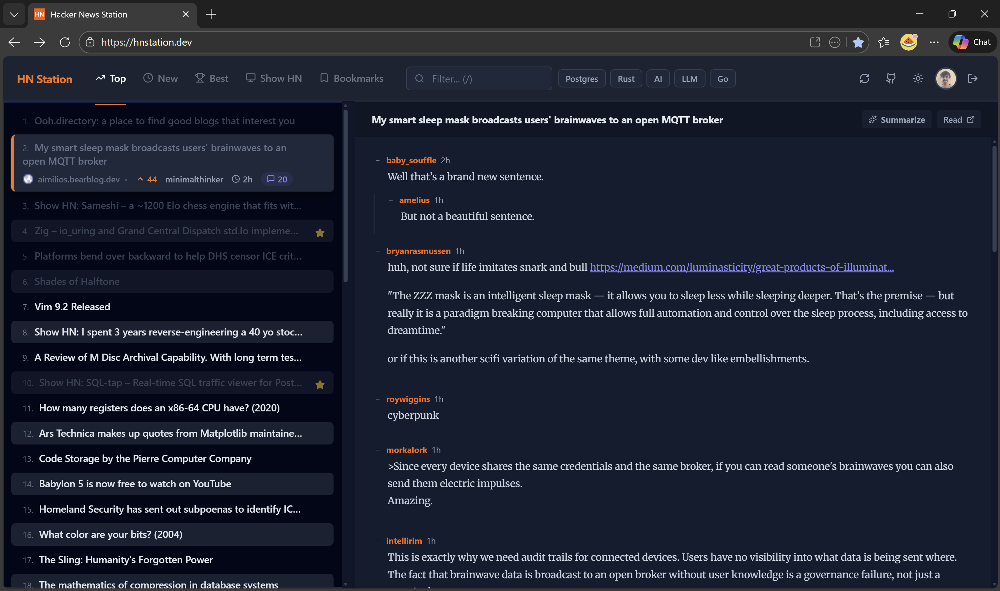
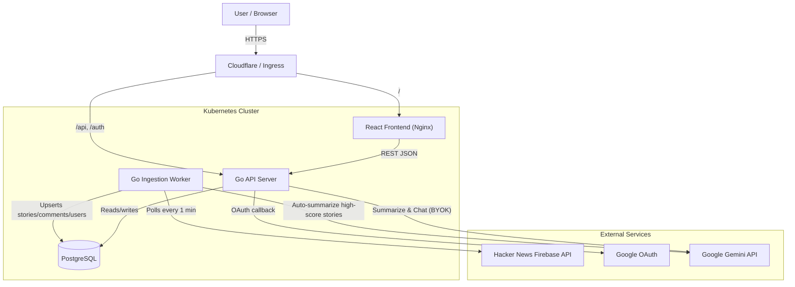

# HN Station — Architecture

> Live at **[hnstation.dev](https://hnstation.dev)** · [README](README.md) · [Source](https://github.com/rajeshkumarblr/hn_station)



HN Station is a feature-rich Hacker News reader that continuously ingests stories and comments from the HN Firebase API, stores them in PostgreSQL, and serves them via a Go HTTP API to a React/TypeScript frontend. Users can authenticate with Google OAuth, save/hide stories, and interact with an AI assistant (Google Gemini 2.5 Flash) for discussion summaries and contextual chat.

> See [README.md](README.md) for setup instructions, feature list, and environment variable reference.

---

## High-Level Architecture



### Component Overview

```
   ┌─────────────────┐              ┌──────────────────────────┐
   │  Ingest Service │              │     Backend API Server   │
   │  (cmd/ingest)   │──────────────│       (cmd/server)       │
   │  Go binary      │  shared DB   │       Go + chi           │
   └────────┬────────┘              └──────────┬───────────────┘
            │                                  │
            ▼                                  ▼
   ┌─────────────────────────────────────────────────────────────┐
   │                   PostgreSQL Database                        │
   │  stories | comments | users | auth_users |                  │
   │  user_interactions | chat_messages                           │
   │  Extensions: pgvector (semantic search, currently disabled) │
   └─────────────────────────────────────────────────────────────┘
                                  │
                         REST JSON API
                                  │
                    ┌─────────────▼────────────┐
                    │   React Frontend (Vite)  │
                    │   web/src/App.tsx         │
                    │   TypeScript + Tailwind   │
                    └──────────────────────────┘
```

---

## Services

### 1. Ingest Service (`cmd/ingest`)

A long-running background process that keeps the database in sync with Hacker News.

**Responsibilities:**
- Fetches Top and New story IDs from `https://hacker-news.firebaseio.com/v0` every minute.
- Uses a worker pool (2 workers) to concurrently fetch and upsert stories, comments, and user profiles.
- Maintains `hn_rank` for current top-500 stories; clears stale ranks.
- Enqueues high-quality stories (score > 10, has URL) to a **summary queue** for automatic AI summarization.
- The summary worker rate-limits itself to **1 request per 10 seconds** (within the Gemini free tier) and uses exponential back-off on quota errors.

**Key packages used:** `internal/hn`, `internal/storage`, `internal/ai`, `internal/content`

### 2. API Server (`cmd/server`)

A single Go binary serving both the REST API and the compiled frontend static files.

Built on `go-chi/chi` with standard middleware (request ID, logging, recovery, 60s timeout, CORS).

#### Routes

| Method | Path | Description |
|--------|------|-------------|
| GET | `/healthc` | Health check |
| GET | `/api/stories` | List stories (sort, topic filter, pagination) |
| GET | `/api/stories/saved` | Saved stories for logged-in user |
| GET | `/api/stories/{id}` | Story detail + comments |
| POST | `/api/stories/{id}/interact` | Mark read / save / hide |
| GET | `/api/stories/{id}/content` | Fetch + parse article content |
| POST | `/api/stories/{id}/summarize` | Summarize HN discussion (Gemini) |
| POST | `/api/stories/{id}/summarize_article` | Summarize article content (Gemini) |
| GET | `/api/chat/{id}` | Fetch chat history for a story |
| POST | `/api/chat` | Send a message to AI chat (Gemini) |
| GET | `/api/me` | Current authenticated user |
| POST | `/api/settings` | Save Gemini API key |
| GET | `/auth/google` | Initiate Google OAuth flow |
| GET | `/auth/google/callback` | OAuth callback → set JWT cookie |
| GET | `/auth/logout` | Clear session cookie |
| GET | `/api/admin/stats` | App-wide stats (admin only) |
| GET | `/api/admin/users` | All users (admin only) |
| `/*` | Static file server → SPA fallback to `index.html` |

---

## Internal Packages

### `internal/hn`
A thin HTTP client for the HN Firebase REST API. Fetches story/comment `Item`s and user `UserItem`s with a 10-second timeout.

### `internal/storage`
All database interactions via `pgxpool` (connection pool). Key data models:

| Model | Table |
|-------|-------|
| `Story` | `stories` |
| `Comment` | `comments` |
| `User` | `users` |
| `AuthUser` | `auth_users` |
| `ChatMessage` | `chat_messages` |
| Interactions | `user_interactions` |

The `GetStories` query dynamically builds SQL to support sorting strategies (`hn_rank`, `score DESC`, `posted_at DESC`), full-text topic filtering (`search_vector @@ tsquery`), and per-user interaction flags via a `LEFT JOIN`.

Semantic vector search is implemented (`SearchStories` using `pgvector`) but currently **disabled** in the API.

### `internal/ai`
Wraps the Google Generative AI Go SDK (`google/generative-ai-go`). Uses **Gemini 2.5 Flash** for both:
- `GenerateSummary` — bullet-point summarization of a story or discussion.
- `GenerateChatResponse` — multi-turn contextual chat, with the story + comments injected as the first message in the conversation history.

Both methods implement **BYOK (Bring Your Own Key)** — the user's own Gemini API key is passed per-request (never stored client-side). A server key is also supported for the automated ingest summarizer.

Retry logic with exponential backoff handles 429 quota errors (up to 5 attempts: 1 s, 2 s, 4 s, 8 s, 16 s).

### `internal/auth`
Google OAuth 2.0 + JWT session management.

- **OAuth flow**: Redirects to Google → callback exchanges code for token → fetches profile → upserts `auth_users` row → issues signed JWT.
- **JWT**: HS256 signed, 30-day expiry, stored as an `HttpOnly` `SameSite=Lax` session cookie (`hn_session`).
- CSRF protection via a short-lived `oauth_state` cookie verified on callback.
- Anonymous usage is fully supported — auth is optional.

### `internal/content`
Fetches and parses article content for the "Reader" pane using `go-shiori/go-readability` (Mozilla Readability port). Falls back to raw HTML if parsing fails. Has special handling for GitHub URLs (falls back to raw `README.md`). Also detects `X-Frame-Options` / CSP headers to determine iframe compatibility.

---

## Database Schema (Migrations)

Migrations live in `migrations/` and are applied sequentially.

| Migration | Description |
|-----------|-------------|
| `000001` | `stories` table (id, title, url, score, by, descendants, posted_at) |
| `000002` | `comments` table with parent threading |
| `000003` | `users` table (HN usernames) |
| `000004` | `hn_rank` column + `search_vector` (tsvector for FTS) |
| `000005` | `auth_users` table (Google OAuth users, JWT, admin flag) |
| `000006` | `user_interactions` table (read, saved, hidden per user-story) |
| `000007` | `embedding` column (pgvector, 768-dim) for semantic search |
| `000008` | `is_hidden` flag added to interactions |
| `000009` | `user_settings` (per-user settings, currently Gemini API key) |
| `000010` | `chat_messages` table (persistent chat history per user-story) |
| `000011` | `summary` column on `stories` (global AI summary cache) |

---

## Frontend (`web/`)

| Tech | Role |
|------|------|
| React 18 + TypeScript | UI framework |
| Vite | Build tool / dev server |
| Tailwind CSS | Utility-first styling |
| `react-resizable-panels` | Draggable column layout |
| `react-router-dom` | Client-side routing (SPA) |
| Lucide React | Icon library |

### Layout

A three-pane, resizable layout:
1. **Story List** (left sidebar) — filterable, sortable, infinite scroll (50 stories per page), keyboard navigable.
2. **Reader Pane** (center) — article content or threaded HN comments with collapsible tree.
3. **AI Sidebar** (right, optional) — chat interface with Gemini, discussion summary, article summary.

### Key Frontend Features
- **Modes**: Top (HN Rank), New (latest), Best (votes), Show HN, Bookmarks.
- **Topic Chips**: Persistent full-text filters with visual color coding.
- **Keyboard Navigation**: Arrow keys, Enter/Escape, `n`/`p` for next/previous comment, `/` for search, `z` for Zen mode.
- **Theme**: Dark/light toggle with `localStorage` persistence.
- **Auth flow**: Google Sign-In redirects to `/auth/google`; sessions are cookie-based (no tokens in JS).
- **BYOK AI**: Users configure their own Gemini API key in Settings, stored server-side per `auth_users`.
- **Read tracking**: Persisted locally (`localStorage`) and server-side (when logged in).

### Components

| Component | Purpose |
|-----------|---------|
| `StoryCard` | Single story row in the list |
| `ReaderPane` | Article iframe / readability view + comment thread |
| `CommentList` | Recursive threaded comment renderer |
| `AISidebar` | Gemini chat + summarize buttons |
| `FilterComboBox` | Topic filter input + quick-filter chips |
| `SettingsModal` | Gemini API key configuration |
| `AdminDashboard` | Admin stats + user table (`/admin` route) |

---

## Infrastructure

### Docker

- **`Dockerfile.backend`** — Multi-stage Go build producing a minimal `alpine` image. The compiled frontend (`web/dist`) is embedded at build time into `web/dist/` relative to the working directory.
- **`web/Dockerfile`** — Builds the React app and serves it via Nginx (for standalone frontend deploys).
- **`docker-compose.yml`** — Local development: backend + PostgreSQL.

### Kubernetes

Two environment targets:

| Directory | Target |
|-----------|--------|
| `infrastructure/k8s/` | **Azure AKS** (production) — uses Azure Key Vault secret provider, cert-manager TLS, NGINX ingress |
| `infrastructure/k8s-local/` | **Kind** (local dev) — uses host network ExternalName service for local Postgres |

**Workloads:**
- `backend` — Deployment running the Go API server.
- `ingest` — Deployment running the ingestion service.
- `frontend` — Deployment serving the React app via Nginx.
- `postgres` — StatefulSet with a PersistentVolumeClaim (Azure) / ExternalName pointing to host Postgres (local).

**Networking:** NGINX Ingress routes `/api/*` and `/auth/*` to the backend, and `/*` to the frontend.

---

## Data Flow: Story Ingestion

```
HN API (top/new IDs)
        │
        ▼
  runIngestion() [every 1 min]
        │
        ├──► UpdateRanks (batch SQL)
        │
        └──► Worker Pool (2 goroutines)
                  │
                  ▼
            processStory()
                  ├── UpsertStory → stories table
                  ├── processUser() (goroutine) → users table
                  ├── processComments() (recursive) → comments table
                  └── [score>10 & has URL] → summaryQueue channel
                                │
                                ▼
                        summaryWorker (rate-limited 1 req/10s)
                                │
                                ├── content.FetchArticle()
                                ├── ai.GenerateSummary()
                                └── store.UpdateStorySummary()
```

## Data Flow: User Chat

```
Frontend POST /api/chat
        │
        ▼
handleChat()
        ├── Auth: validate JWT cookie
        ├── Fetch user (get Gemini API key)
        ├── Fetch story + comments (context)
        ├── Fetch chat history from DB
        ├── Save user message → chat_messages
        ├── ai.GenerateChatResponse(apiKey, context, history, message)
        └── Save model response → chat_messages
                 │
                 ▼
        Return JSON {response: "..."}
```
