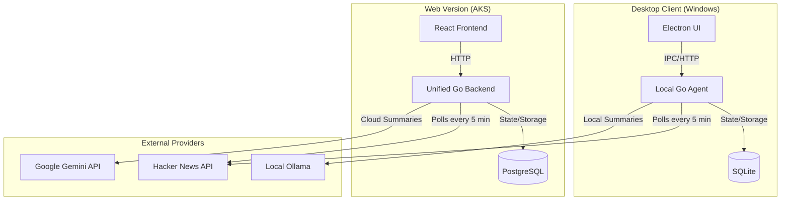

# HN Station — Architecture

> Live at **[hnstation.dev](https://hnstation.dev)** · [README](README.md) · [Source](https://github.com/rajeshkumarblr/hn_station)

HN Station is a high-performance Hacker News reader featuring a dual-mode architecture: a **Cloud-based Web Version** (AKS) and a **Local-First Desktop Client** (Electron). It provides rich AI summaries, advanced story extraction (including PDF and GitHub READMEs), and a seamless split-pane workspace.

---

## High-Level Architecture

HN Station operates in two primary modes:

### 1. Cloud Mode (Web)
Deployable to AKS, this mode uses a shared infrastructure for multiple users.

- **Unified Backend**: A Go server serving both the REST API and embedded React SPA.
- **Data Layer**: PostgreSQL for shared persistence.
- **Deployment**: Kubernetes-native via Azure ACR/AKS.

### 2. Local Mode (Desktop)
A zero-login, privacy-focused experience for Windows.

- **Local Agent**: A Go-based backend process (`hn-local.exe`) that runs on `localhost:58090`.
- **App-Bound Ingestion**: The agent handles continuous HN ingestion while the app is running.
- **Data Layer**: SQLite for local persistence in `%APPDATA%/HN Station/`.
- **UI**: Electron wrapper with native optimizations.

---

## Internal Packages

### `internal/content`
Handles rich article extraction for both the Reader Pane and AI context.
- **PDF Extraction**: Extracts text from PDF documents (up to 20 pages) for summarization.
- **GitHub Integration**: Automatically fetches project `README.md` files from GitHub repositories linked in "Show HN" posts.
- **Readability**: Uses `go-shiori/go-readability` for standard article parsing.

### `internal/ai`
The AI orchestration layer.
- **Summarization**: Generates bullet-point takeaways from stories and discussions.
- **Chat**: Provides multi-turn contextual chat about any HN story.
- **Dual Support**: Compatible with local **Ollama** models and **Google Gemini** (Pro/Flash).

### `internal/storage`
A database-agnostic repository layer (supporting both **PostgreSQL** via `pgx` and **SQLite** via `modernc.org/sqlite`). Handles:
- **Story/Comment Persistence**: Efficient upserts and rank management.
- **Interactions**: Tracking read, saved (bookmarked), and hidden flags.
- **Summary Cache**: Global caching of AI summaries to minimize token usage.

---

## Frontend Layout (`web/`)

The UI is a three-pane workspace designed for high-density information consumption.

1. **Category Navigation** (Top Header): Switch between Top, New, Best, and Show HN.
2. **Tabbed Workspace**:
    - **Primary Tabs**: Persistent **FEED** and **BOOKMARKS** tabs.
    - **Reader Tabs**: Individual story tabs that support side-by-side Article/Comments view.
3. **AI Sidebars**:
    - **Global Sidebar** (Feed View): Context-aware pane containing "Article Summary" and "Article Topics" for rapid triage.
    - **Reader Sidebar** (Article View): Specialized `AISidebar` with tabs for **Discussion** (comment analysis), **Chat**, and **Summary**.

### Keyboard Shortcuts (Core)
- `Ctrl + W`: Close active tab (or Exit App in Feed view).
- `Ctrl + D`: Toggle Bookmark for selected story.
- `Ctrl + 0`: Instantly switch back to Feed.
- `Ctrl + Space`: Cycle reader layouts.
